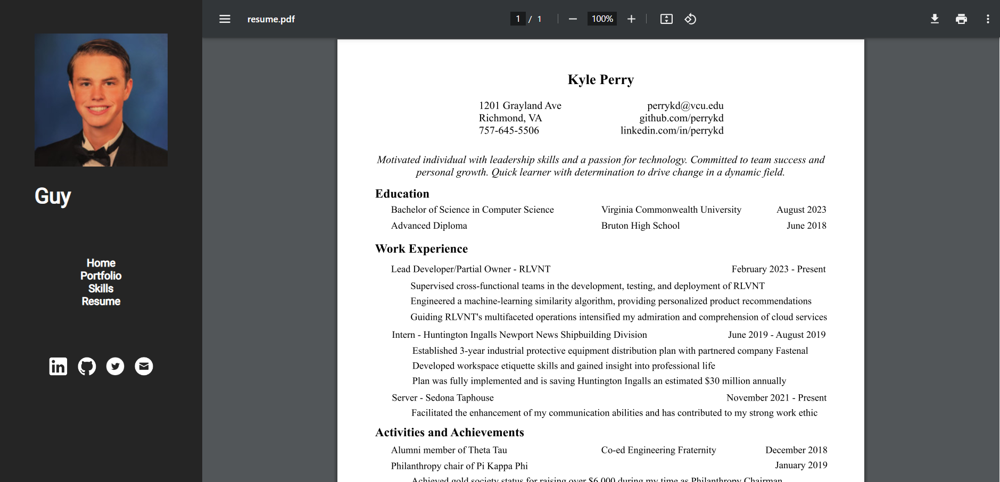
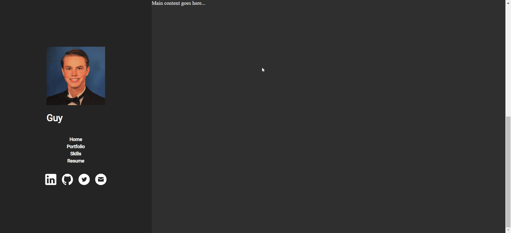

# My Portfolio: A Journey of Progress (Currently Developing: portfoliov6)

## Introduction
Welcome to my evolving portfolio! Currently in its fifth iteration (portfoliov5), this repository reflects a journey of continuous growth and improvement. Explore the current version, or take a look back at previous iterations to see the transformation.

> **Current Idea**: My current concept for my portfolio is to display a gif upon opening the website, displaying shots of me in my life enjoying hobbies, programming, etc. Then, an animation will take you down to the sidebar adjacent to the main content of my page. The sidebar will allow you to click through main content displays, which will dynamically change

> The best current version is **[portfoliov4](portfoliov4)**

## Table of Contents
- [Current Version: portfoliov5](#current-version-portfoliov5)
- [Previous Versions](#previous-versions)
- [Technologies Used](#technologies-used)
- [Setup and Installation](#setup-and-installation)
- [Usage](#usage)

## Current Version: portfoliov5
- **Overview**: Focusing on perfecting responsiveness as I have gotten down grid and site organizaton. 
- **Features**: Responsive design that can accessed on both mobile and desktop.
- **Progress**: Still kinking out bug fixes, but overall, I am happy with the progress I have made.

## Previous Versions
### portfoliov5
- **Highlights**: Responsive to mobile broswers as well as desktop, not fully implemented yet, doesn't include tab features from sidebar
- **[View portfoliov5](portfoliov5)**

### portfoliov4
- **Highlights**: Includes functional tab features from side bar, lacks mobile responsiveness
- **[View portfoliov4](link-to-portfoliov4)**

### Previous portfolios
- **Highlights**: Includes functional tab features from side bar, dynamically loads sidebar and values for main content, lacks mobile responsiveness

## Technologies Used
- HTML
- CSS
- JavaScript

## Usage
Test with live server on index.html for any version

---

Explore, enjoy, and feel free to connect with me for any inquiries or feedback!
